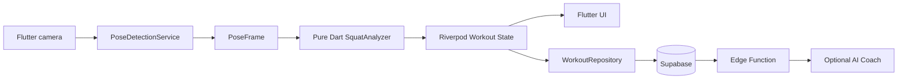

# FormAI

FormAI는 스마트폰 카메라로 사용자의 운동 동작을 기기에서 실시간 분석하고, 반복 횟수와 자세 정보를 제공하는 Flutter 모바일앱입니다.

```text
Flutter
├── Android
└── iOS
```

현재 구현 milestone은 카메라 프리뷰, 이미지 스트림, 기기 내 ML Kit Pose Detection, 실시간 Skeleton Overlay입니다. 기존 Next.js scaffold는 레거시 초기 상태이며 제품 구현 기준이 아닙니다.

## MVP

```text
Camera → On-device Pose Detection → Knee Angle → Squat State Machine
→ Rep Count → Workout Result
```

첫 MVP는 스쿼트 한 종목이며 통제된 환경에서 정상 10회를 9~11회로 인식하는 것이 성공 기준입니다.

## Architecture



원본 video/photo/camera frame은 서버, Supabase Storage, LLM으로 전송하지 않습니다.

## Tech Stack

- Flutter/Dart
- Riverpod
- Flutter `camera` package
- Google ML Kit Pose Detection
- `flutter_test`, `mocktail`

Supabase, 인증, 라우팅, 로컬 저장소는 아직 구현하지 않았습니다. 정확한 package 버전은 `pubspec.lock`에 고정됩니다.

## Documentation

- [Product Overview](docs/00_PRODUCT_OVERVIEW.md)
- [PRD](docs/01_PRD.md)
- [User Flow](docs/02_USER_FLOW.md)
- [Screen Specification](docs/03_SCREEN_SPEC.md)
- [Wireframes](docs/04_WIREFRAMES.md)
- [Tech Stack](docs/05_TECH_STACK.md)
- [Architecture](docs/06_ARCHITECTURE.md)
- [Database Schema](docs/07_DATABASE_SCHEMA.md)
- [API Specification](docs/08_API_SPEC.md)
- [Pose Detection](docs/09_POSE_DETECTION.md)
- [Squat Algorithm](docs/10_SQUAT_ALGORITHM.md)
- [AI Coach Prompt](docs/11_AI_COACH_PROMPT.md)
- [Security & Privacy](docs/12_SECURITY_PRIVACY.md)
- [Test Strategy](docs/13_TEST_STRATEGY.md)
- [MVP Plan](docs/14_MVP_PLAN.md)
- [Roadmap](docs/15_ROADMAP.md)
- [Coding Rules](docs/16_CODING_RULES.md)
- [Definition of Done](docs/17_DEFINITION_OF_DONE.md)

## Setup

```bash
brew install cmake # macOS: Hand Landmarker native asset build prerequisite
flutter pub get
flutter run
```

## Environment Variables

| Name | Exposure | Purpose |
|---|---|---|
| `APP_ENV` | non-secret | development/staging/production |
| `SUPABASE_URL` | public | project URL |
| `SUPABASE_PUBLISHABLE_KEY` | publishable | RLS 보호 client key |

service role, LLM secret, backend admin/private key는 Flutter 앱에 절대 포함하지 않습니다.

## Validation

```bash
dart format --output=none --set-exit-if-changed .
flutter analyze
flutter test
flutter build apk --debug
flutter build ios --no-codesign
```

Pose 기능은 emulator만으로 완료 판정하지 않고 실제 Android와 iPhone에서 검증합니다.

## Project Structure

```text
lib/
├── main.dart
├── app/
├── core/
├── features/
│   ├── workout/
│   │   ├── domain/
│   │   ├── application/
│   │   ├── infrastructure/
│   │   └── presentation/
└── main.dart
```

## Privacy and Limitations

카메라 영상은 기기에서 처리되며 기본적으로 저장되지 않습니다. MVP는 한 사람, 충분한 조명, 스마트폰 고정, 전신이 보이는 측면 촬영을 전제로 합니다. 2D pose와 초기 threshold는 실기기·다양한 체형에서 추가 검증이 필요합니다. FormAI는 의료기기나 진단 서비스가 아니며 안전을 보장하지 않습니다.

## Roadmap

Squat Rep Count → deterministic form cues → 추가 운동 → AI personalized coach → subscription/social/health integration.
