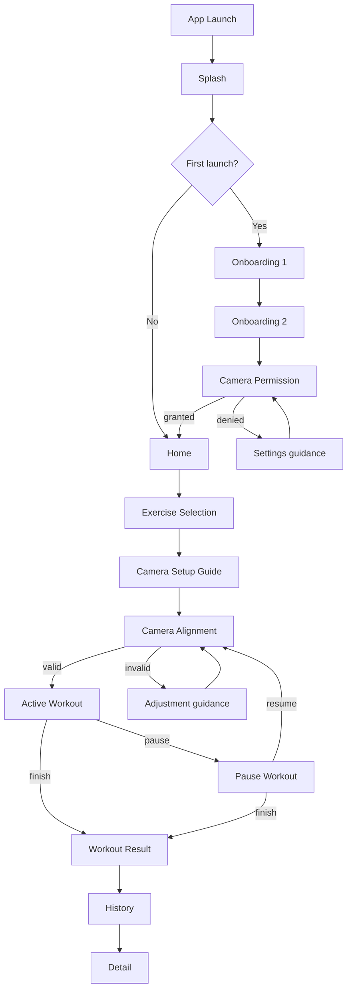
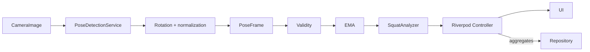
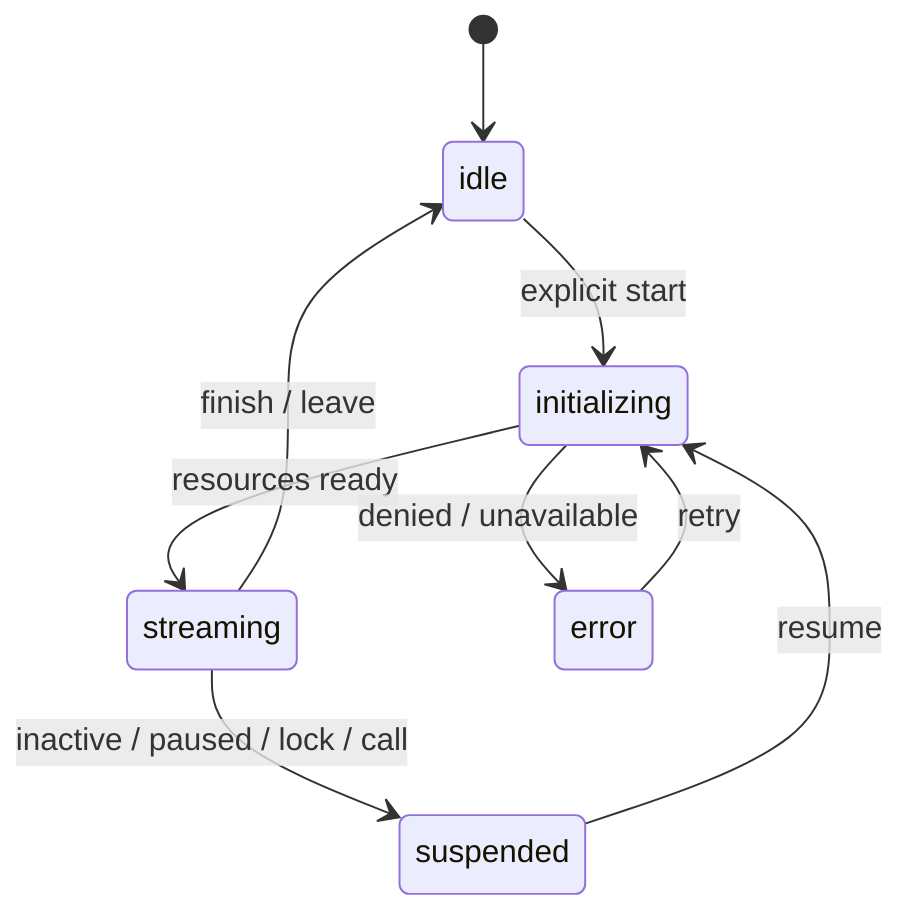

# User Flow

## Primary Flow

## Runtime Flow

## Lifecycle Flow

## Exceptional Rules

- permanently denied는 settings CTA를 제공하고 prompt loop를 만들지 않는다.
- interruption/background는 stream과 inference를 중단하고 incomplete rep을 취소한다.
- resume은 permission 재검사 후 alignment부터 시작한다.
- invalid pose에서는 count를 중지한다.
- save failure에도 local result를 유지한다.
