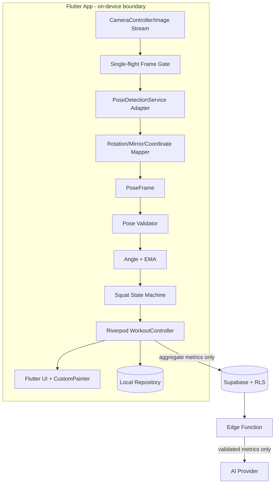

# Mobile Architecture

## Principles

1. Android/iOS Flutter 단일 코드베이스다.
2. raw frame의 lifetime은 camera → pose adapter 호출 동안만이다.
3. ML SDK, 운동 분석, UI를 분리한다.
4. 실시간 경로는 deterministic이며 network/LLM 비의존이다.
5. application/domain은 infrastructure를 interface로 의존한다.

## System Diagram



## Layer Responsibilities

| Layer | Owns | Must not know |
|---|---|---|
| domain | entities, enum, analyzer interfaces/invariants | Flutter, Riverpod, ML Kit, camera, Supabase |
| application | angle, EMA, state machine, controller/use cases | widgets, native SDK details |
| infrastructure | camera, ML Kit adapter, repository, Supabase DTO mapping | UI composition, exercise rules |
| presentation | screens, Riverpod bindings, PosePainter | ML Kit types, SQL, angle/state implementation |

Flutter `WidgetsBindingObserver` 또는 동등한 lifecycle binding에서
`AppLifecycleState.inactive`, `paused`, `detached`, `resumed`를 명시적으로
application lifecycle command로 변환한다. presentation callback 안에서 직접
resource를 임의 조작하지 않는다.

## Dependency Flow

```text
Presentation
    ↓ watches/commands
WorkoutController (application)
    ├── PoseDetectionService interface
    ├── SquatAnalyzer interface
    └── WorkoutRepository interface
             ↑ infrastructure adapters
```

## Planned Structure

```text
lib/
├── main.dart
├── app/
│   ├── app.dart
│   ├── router.dart
│   └── theme.dart
├── core/
│   ├── constants/
│   ├── errors/
│   ├── lifecycle/
│   ├── utils/
│   └── widgets/
├── features/
│   ├── onboarding/
│   ├── home/
│   ├── workout/
│   │   ├── domain/
│   │   │   ├── exercise.dart
│   │   │   ├── joint_type.dart
│   │   │   ├── pose_point.dart
│   │   │   ├── pose_frame.dart
│   │   │   ├── squat_phase.dart
│   │   │   └── workout_session.dart
│   │   ├── application/
│   │   │   ├── angle_calculator.dart
│   │   │   ├── ema_filter.dart
│   │   │   ├── squat_state_machine.dart
│   │   │   ├── squat_analyzer.dart
│   │   │   └── workout_controller.dart
│   │   ├── infrastructure/
│   │   │   ├── camera_service.dart
│   │   │   ├── ml_kit_pose_detection_service.dart
│   │   │   └── workout_repository.dart
│   │   └── presentation/
│   │       ├── workout_screen.dart
│   │       └── widgets/
│   │           ├── pose_painter.dart
│   │           ├── rep_counter.dart
│   │           └── feedback_banner.dart
│   ├── history/
│   └── profile/
└── services/
```

## Core Contracts

```dart
abstract interface class PoseDetectionService {
  Future<void> initialize();
  Future<PoseFrame?> process(CameraFrameInput input);
  Future<void> close();
}

abstract interface class ExerciseAnalyzer {
  AnalysisResult analyze(PoseFrame frame);
  void resetAttempt();
  void reset();
}

abstract interface class WorkoutRepository {
  Future<WorkoutSession> save(WorkoutSession session);
  Future<List<WorkoutSession>> listMine();
}
```

`CameraFrameInput`은 infrastructure 전용이며 domain으로 전달하지 않는다. domain의 `PoseFrame`만 SDK-independent다.

## Riverpod Providers

- `cameraServiceProvider`: infrastructure dependency, auto-dispose.
- `poseDetectionServiceProvider`: auto-dispose; close 보장.
- `workoutControllerProvider`: workout orchestration.
- `workoutSessionProvider`: controller state에서 파생.
- `exerciseHistoryProvider`: P1 repository query.
- `settingsProvider`: camera/privacy preferences.

Widget은 provider를 통해 command를 보내며 detector를 직접 호출하지 않는다.

## Camera and Inference Lifecycle

1. 사용자 CTA → permission check/request.
2. camera initialize → image stream start → detector initialize.
3. single-flight guard가 10~15 FPS target으로 frame을 선택한다.
4. adapter가 rotation/format을 변환하고 즉시 PoseFrame만 반환한다.
5. frame 참조를 보관하지 않는다.
6. inactive/background/route leave → stream stop → controller dispose → detector close.
7. resume → permission 재확인 → camera 재생성 → alignment gate.

close/dispose는 여러 번 호출해도 안전해야 한다.

## Data Boundary

| Data | Device transient | Local DB | Supabase | LLM |
|---|---:|---:|---:|---:|
| raw frame/video/photo | yes | never | never | never |
| raw landmarks | yes | no by default | no | no |
| live angle/phase | yes | no | no | no |
| aggregate workout metrics | yes | optional | optional | post-workout allowlist |
| secrets | no | secure token only | managed | Edge secret |

## Extensibility

운동별 analyzer와 setup config를 registry로 제공한다. 새 운동은 domain analyzer, fixture, screen copy를 추가하되 camera/pose pipeline을 재작성하지 않는다.
