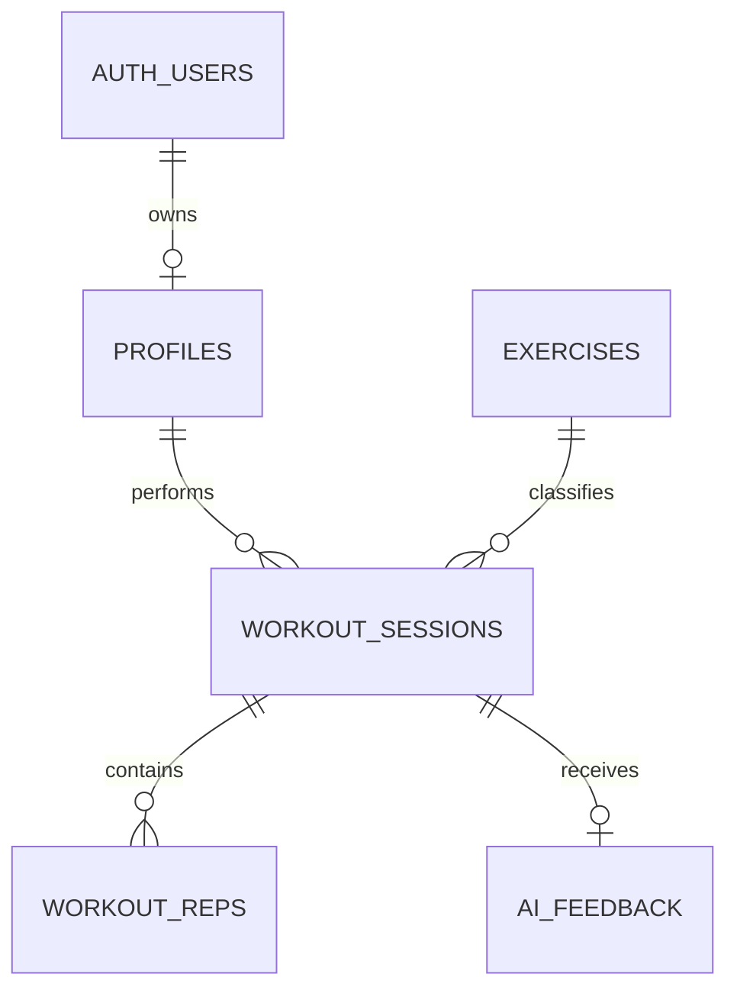

# Supabase PostgreSQL Schema

## Policy

서버에는 aggregate workout metrics만 저장한다. camera video/photo/raw frame/raw landmark 배열은 table이나 Storage bucket에 저장하지 않는다. MVP P0의 카운팅은 DB/network 없이 동작해야 한다.

## ERD



## Columns

### profiles

| Column | Type | Null | Default | Key/index/constraint | Description |
|---|---|---:|---|---|---|
| id | uuid | no | — | PK, FK auth.users | user identity |
| display_name | text | yes | null | length 1..80 | 표시 이름 |
| experience_level | text | no | beginner | enum check | beginner/intermediate/advanced |
| created_at | timestamptz | no | now() | — | 생성 |
| updated_at | timestamptz | no | now() | — | 수정 |

### exercises

| Column | Type | Null | Default | Key/index/constraint | Description |
|---|---|---:|---|---|---|
| id | uuid | no | gen_random_uuid() | PK | ID |
| slug | text | no | — | unique | squat 등 |
| name | text | no | — | 1..100 | 표시명 |
| category | text | no | strength | index | 분류 |
| is_active | boolean | no | false | partial index | 활성 |
| created_at | timestamptz | no | now() | — | 생성 |

### workout_sessions

| Column | Type | Null | Default | Key/index/constraint | Description |
|---|---|---:|---|---|---|
| id | uuid | no | gen_random_uuid() | PK | session |
| user_id | uuid | no | — | FK profiles; user/date index | owner |
| exercise_id | uuid | no | — | FK exercises | 운동 |
| client_session_id | uuid | no | — | unique with user | offline retry idempotency |
| status | text | no | active | active/completed/abandoned | 상태 |
| started_at | timestamptz | no | now() | — | UTC 시작 |
| ended_at | timestamptz | yes | null | completed consistency | UTC 종료 |
| duration_seconds | integer | no | 0 | 0..86400 | pause 제외 |
| total_reps | integer | no | 0 | 0..10000 | count |
| valid_rep_count | integer | no | 0 | <= total | valid |
| shallow_rep_count | integer | no | 0 | >=0 | 얕은 시도 |
| avg_rep_duration_ms | integer | yes | null | >0 | 평균 |
| avg_bottom_knee_angle | numeric(5,2) | yes | null | 0..180 | 평균 |
| average_pose_confidence | numeric(4,3) | yes | null | 0..1 | 평균 |
| form_score | numeric(5,2) | yes | null | 0..100 | Phase 2, versioned |
| analyzer_version | text | no | — | nonempty | squat-v1 |
| metrics | jsonb | no | {} | object | allowlisted aggregates |
| created_at/updated_at | timestamptz | no | now() | — | audit |

### workout_reps

| Column | Type | Null | Default | Key/index/constraint | Description |
|---|---|---:|---|---|---|
| id | uuid | no | gen_random_uuid() | PK | rep |
| session_id | uuid | no | — | FK cascade; unique with rep | parent |
| rep_number | integer | no | — | >0 | 순번 |
| duration_ms | integer | yes | null | 100..60000 | 시간 |
| min_knee_angle | numeric(5,2) | yes | null | 0..180 | minimum |
| max_knee_angle | numeric(5,2) | yes | null | 0..180 | maximum |
| quality_score | numeric(5,2) | yes | null | 0..100 | Phase 2 |
| detected_issues | text[] | no | {} | allowlist at API | issue codes |
| created_at | timestamptz | no | now() | — | 생성 |

### ai_feedback

| Column | Type | Null | Default | Key/index/constraint | Description |
|---|---|---:|---|---|---|
| id | uuid | no | gen_random_uuid() | PK | feedback |
| session_id | uuid | no | — | FK cascade, unique | parent |
| summary | text | no | — | 1..600 | 요약 |
| strengths | jsonb | no | [] | array | 강점 |
| improvements | jsonb | no | [] | array | 개선 |
| recommendation | text | no | — | 1..300 | next action |
| confidence | text | no | — | low/medium/high | 신뢰도 |
| model_name | text | no | — | nonempty | audit |
| prompt_version | text | no | — | nonempty | audit |
| created_at | timestamptz | no | now() | — | 생성 |

## SQL

```sql
create extension if not exists pgcrypto;

create table public.profiles (
  id uuid primary key references auth.users(id) on delete cascade,
  display_name text check (display_name is null or char_length(display_name) between 1 and 80),
  experience_level text not null default 'beginner'
    check (experience_level in ('beginner','intermediate','advanced')),
  created_at timestamptz not null default now(),
  updated_at timestamptz not null default now()
);

create table public.exercises (
  id uuid primary key default gen_random_uuid(),
  slug text not null unique check (slug ~ '^[a-z][a-z0-9_]{1,49}$'),
  name text not null check (char_length(name) between 1 and 100),
  category text not null default 'strength',
  is_active boolean not null default false,
  created_at timestamptz not null default now()
);
create index exercises_active_idx on public.exercises (category) where is_active;

create table public.workout_sessions (
  id uuid primary key default gen_random_uuid(),
  user_id uuid not null references public.profiles(id) on delete cascade,
  exercise_id uuid not null references public.exercises(id) on delete restrict,
  client_session_id uuid not null,
  status text not null default 'active'
    check (status in ('active','completed','abandoned')),
  started_at timestamptz not null default now(),
  ended_at timestamptz,
  duration_seconds integer not null default 0 check (duration_seconds between 0 and 86400),
  total_reps integer not null default 0 check (total_reps between 0 and 10000),
  valid_rep_count integer not null default 0
    check (valid_rep_count between 0 and total_reps),
  shallow_rep_count integer not null default 0 check (shallow_rep_count between 0 and 10000),
  avg_rep_duration_ms integer check (avg_rep_duration_ms > 0),
  avg_bottom_knee_angle numeric(5,2) check (avg_bottom_knee_angle between 0 and 180),
  average_pose_confidence numeric(4,3) check (average_pose_confidence between 0 and 1),
  form_score numeric(5,2) check (form_score between 0 and 100),
  analyzer_version text not null check (char_length(analyzer_version) between 1 and 50),
  metrics jsonb not null default '{}'::jsonb check (jsonb_typeof(metrics) = 'object'),
  created_at timestamptz not null default now(),
  updated_at timestamptz not null default now(),
  unique (user_id, client_session_id),
  check (
    (status = 'completed' and ended_at is not null) or
    (status <> 'completed' and ended_at is null)
  )
);
create index sessions_user_started_idx
  on public.workout_sessions (user_id, started_at desc);

create table public.workout_reps (
  id uuid primary key default gen_random_uuid(),
  session_id uuid not null references public.workout_sessions(id) on delete cascade,
  rep_number integer not null check (rep_number > 0),
  duration_ms integer check (duration_ms between 100 and 60000),
  min_knee_angle numeric(5,2) check (min_knee_angle between 0 and 180),
  max_knee_angle numeric(5,2) check (max_knee_angle between 0 and 180),
  quality_score numeric(5,2) check (quality_score between 0 and 100),
  detected_issues text[] not null default '{}',
  created_at timestamptz not null default now(),
  unique (session_id, rep_number)
);

create table public.ai_feedback (
  id uuid primary key default gen_random_uuid(),
  session_id uuid not null unique references public.workout_sessions(id) on delete cascade,
  summary text not null check (char_length(summary) between 1 and 600),
  strengths jsonb not null default '[]'::jsonb check (jsonb_typeof(strengths) = 'array'),
  improvements jsonb not null default '[]'::jsonb check (jsonb_typeof(improvements) = 'array'),
  recommendation text not null check (char_length(recommendation) between 1 and 300),
  confidence text not null check (confidence in ('low','medium','high')),
  model_name text not null,
  prompt_version text not null,
  created_at timestamptz not null default now()
);

insert into public.exercises (slug, name, category, is_active)
values ('squat', 'Squat', 'strength', true)
on conflict (slug) do nothing;
```

## RLS

```sql
alter table public.profiles enable row level security;
alter table public.exercises enable row level security;
alter table public.workout_sessions enable row level security;
alter table public.workout_reps enable row level security;
alter table public.ai_feedback enable row level security;

create policy profiles_own_all on public.profiles
  for all using ((select auth.uid()) = id)
  with check ((select auth.uid()) = id);

create policy exercises_read_active on public.exercises
  for select using (is_active);

create policy sessions_own_all on public.workout_sessions
  for all using ((select auth.uid()) = user_id)
  with check ((select auth.uid()) = user_id);

create policy reps_own_all on public.workout_reps
  for all using (exists (
    select 1 from public.workout_sessions s
    where s.id = session_id and s.user_id = (select auth.uid())
  )) with check (exists (
    select 1 from public.workout_sessions s
    where s.id = session_id and s.user_id = (select auth.uid())
  ));

create policy feedback_read_own on public.ai_feedback
  for select using (exists (
    select 1 from public.workout_sessions s
    where s.id = session_id and s.user_id = (select auth.uid())
  ));
```

AI feedback write는 Edge Function server role만 수행하되 JWT ownership을 먼저 검증한다. Storage bucket은 MVP에서 만들지 않는다.
