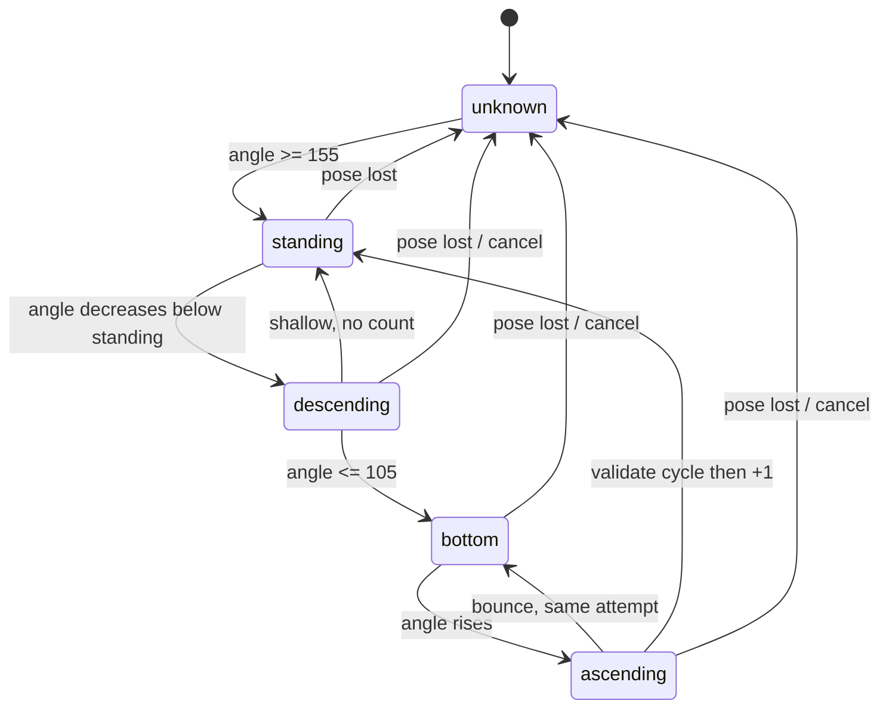

# Squat Algorithm — squat-v1

모든 핵심 함수는 Flutter Widget, Riverpod, camera, ML SDK에 의존하지 않는 pure Dart다. 초기 threshold는 **추가 검증 필요**다.

## Config

| Parameter | Initial |
|---|---:|
| standing angle | ≥155° |
| bottom angle | ≤105° |
| minimum ROM | 45° |
| rep cooldown | 400ms |
| landmark confidence | 0.5 |
| EMA alpha | 0.35 |
| tracking loss reset | 500ms |

## Angle

A=hip, B=knee, C=ankle:

```text
BA = A - B
BC = C - B
theta = acos(clamp((BA dot BC) / (|BA| * |BC|), -1, 1))
```

```dart
double? calculateAngle(PosePoint a, PosePoint b, PosePoint c) {
  final bax = a.x - b.x;
  final bay = a.y - b.y;
  final bcx = c.x - b.x;
  final bcy = c.y - b.y;
  final denominator = sqrt(bax * bax + bay * bay) *
      sqrt(bcx * bcx + bcy * bcy);
  if (!denominator.isFinite || denominator <= 1e-8) return null;
  final cosine = ((bax * bcx + bay * bcy) / denominator).clamp(-1.0, 1.0);
  return acos(cosine) * 180 / pi;
}
```

실제 signature는 요구 호환을 위해 non-null `double calculateAngle(...)`을 제공할 수 있으나 degenerate input 처리 정책(Exception 또는 nullable helper)을 명시한다. 권장은 `double?` 내부 helper + validator 선행이다.

## EMA

```text
first = current
smoothed = 0.35 * current + 0.65 * previous
```

MVP는 selected knee angle에 한 번만 적용한다. invalid frame은 EMA를 갱신하지 않고 tracking reset에서 초기화한다.

## Side Selection

- 좌/우 hip-knee-ankle confidence가 모두 유효하면 최소 confidence가 높은 side를 선택한다.
- side switch는 standing 상태에서만, 후보 우위가 연속 유지될 때 한다.
- 한 rep 도중 side를 바꾸지 않는다.
- 양측 angle은 metrics에 계산할 수 있지만 count는 selected angle 하나를 사용한다.

## State

```dart
enum SquatPhase { unknown, standing, descending, bottom, ascending }

class SquatMetrics {
  final double leftKneeAngle;
  final double rightKneeAngle;
  final double selectedKneeAngle;
  final SquatPhase phase;
  final bool poseValid;
}
```



## Valid Rep Invariant

```text
standing observed before descent
AND bottom observed at <=105°
AND returned to >=155°
AND standingPeak - bottomMin >=45°
AND pose remained valid
AND now - lastRepAt >=400ms
```

count event는 ascending → standing transition에서 한 번만 발생한다. standing 유지, threshold jitter, bottom bounce로 추가 count하지 않는다.

## Transition Stabilization

- EMA 후 angle을 사용한다.
- direction deadband 초기 3°와 threshold dwell 초기 2 inference frames를 권장한다.
- exact 값은 inclusive다.
- shallow attempt는 bottom에 도달하지 않고 standing으로 돌아오면 0 rep이다.
- bottom min 80~105는 `GOOD` cue 후보, minimum >120은 `TOO_SHALLOW` 후보지만 의료/안전 판단이 아니다.

deadband/dwell은 요구 threshold와 함께 **추가 검증 필요**다.

## Pseudocode

```text
onPoseFrame(frame):
  validity = validate(frame)
  if invalid:
    if lost >= 500ms: phase=unknown; cancel attempt; reset EMA
    return no event

  left/right = calculate angles
  selected = stable side selection
  angle = ema(selected)
  update peak/min/direction

  unknown: standing 조건 전 count 금지
  standing + descending signal: start attempt
  descending + angle<=105: bottomReached=true
  descending + return standing without bottom: shallow, reset
  bottom + rising: ascending
  ascending + return bottom: retain same attempt
  ascending + angle>=155:
    if bottomReached && ROM>=45 && cooldown>=400: emit repCompleted once
    reset attempt into standing
```

## Edge Cases

| Case | Result |
|---|---|
| 시작부터 bottom | standing을 먼저 볼 때까지 0 |
| 170→145→130→170 | shallow, 0 |
| bottom bounce | 최종 standing에서 최대 1 |
| tracking loss during rep | attempt cancel, 0 |
| background/pause | attempt cancel, rep 유지 |
| rapid duplicate within 400ms | 0 |
| NaN/zero-length vector | invalid |
| side occlusion mid-rep | side 연결 금지; invalid 처리 |

## Unit Fixtures

| Sequence | Expected |
|---|---|
| 170,150,125,95,120,145,165 | rep 1 |
| 170,145,130,125,145,170 | rep 0 |
| 170,150,110,103,107,101,105,125,150,165 | rep 1 |
| standing,descending,missing,missing,standing | rep 0 |
| complete then 165 repeated | remains 1 |
| 170,100,120,100,130,165 | bounce, rep 1 |

fixture는 timestamp, dwell, EMA를 포함한다. angle은 0/90/180, clamp, NaN, zero vector를 별도로 검증한다.

## Calibration

최소 5명 × 정상 10회와 shallow/standing negatives를 실기기에서 측정한다. 사람별 split, camera height/distance, front/rear, Android/iOS를 포함한다. threshold 변경은 analyzer version과 regression fixture를 함께 갱신한다.
